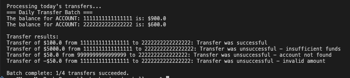

# Mable Back End Code Challenge

A simple banking system: load a company's account balances from a CSV, then apply a day's transfers from another CSV. A transfer that would overdraw an account, references an unknown account, or has a negative amount gets skipped and reported - the rest of the batch still runs. Malformed input (bad rows, duplicate account numbers, invalid CSV syntax) is handled the same way - skipped and warned about, never a crash.

*Built with Claude Code as a TDD pairing partner - used deliberately to enforce strict test-first discipline and catch mistakes early while every design decision and logic stayed mine.*

## Setup

```
bundle install
```

Needs Ruby >= 3.1 (built and tested on 3.1.0p0).

## Running the tests

```
bundle exec rspec
```

## Running it

```
ruby bin/run.rb
```

Runs the provided `data/mable_account_balances.csv` / `data/mable_transactions.csv` and prints a report: final balances, one line per transfer with its outcome, and a summary count.

To run a different day's files: `ruby bin/run.rb path/to/balances.csv path/to/transfers.csv`.

Example output from a mixed batch (success, insufficient funds, account not found, invalid amount all in one run):



## Assumptions

- **Input delivery**: CLI args / local file paths, for this exercise. In a real deployment the file would arrive from the client company some other way (an upload endpoint, SFTP, etc.), not a console command. `bin/run.rb`'s CLI args exist so this is actually runnable and testable here, not as a stand-in for how input would really get in.
- **Output format**: console summary for now (final balances + a success/fail line per transfer). Easy to swap for a CSV writer later if preferred.
- **Unknown account number**: skip that transfer, keep processing the rest, report `account_not_found`.
- **Overdraft**: skip that transfer, report `insufficient_funds`, keep processing the rest.
- **Negative transfer amount**: same treatment, reported as `invalid_amount`.
- **Malformed CSV row** (wrong column count, a value that won't parse, an invalid account number, invalid CSV syntax): skip the row, warn on stderr, keep loading the rest of the file. Warnings never print the actual field values - only a row number and a fixed reason - so a real account number or balance can't end up in a log.
- **Duplicate account number** in the balances file: first occurrence wins, later ones are skipped and warned about rather than silently overwriting the earlier balance.
- **Account numbers** must be exactly 16 digits, enforced in `Account`.
- **Money** is always `BigDecimal`, never `Float` - avoids cent-level rounding drift across a batch.
- **Scope**: single company, single ledger, matching the brief.

## Testing

Loader specs run against small fixture CSVs in `spec/fixtures/`, not the provided sample data - keeps them decoupled from anything unrelated to parsing. `BatchRunner`'s spec covers three integration scenarios: a small fixture (basic wiring), the real provided CSVs (final balances match the table below), and a mixed-batch fixture covering every failure path, since the provided sample data is all happy-path.

### Expected result for the provided sample data

| Account | Start | End |
|---|---:|---:|
| 1111234522226789 | 5000.00 | 4820.50 |
| 1111234522221234 | 10000.00 | 9974.40 |
| 2222123433331212 | 550.00 | 1550.00 |
| 1212343433335665 | 1200.00 | 1725.60 |
| 3212343433335755 | 50000.00 | 48679.50 |

All four sample transfers succeed - asserted directly in `spec/batch_runner_spec.rb`.

## Design

- `Account` - balance plus the two invariants that can never break: it can't go negative, and the account number must be 16 digits.
- `Transfer` - a requested move of money between two account numbers. `#execute(ledger)` does the work and returns a `TransferResult`.
- `TransferResult` - what happened to a transfer: success or not, and why if not.
- `Ledger` - a lookup table, account number -> `Account`.
- `AccountLoader` / `TransferLoader` - turn the CSV files into the objects above. Skip and warn on a malformed row rather than failing the whole file.
- `BatchRunner` - orchestrates a full run: builds the `Ledger`, loads the transfers, executes each one, hands back `{ results:, ledger: }`.
- `ConsoleReport` - prints the result: final balances, per-transfer outcomes, a summary count.
- `bin/run.rb` - entry point. Optional CLI args for a different day's files, falls back to the provided sample CSVs otherwise.

## Stretch goals

Things I'd add if this were a real system instead of a time-boxed exercise:

- **Lock down which files it'll read.** `bin/run.rb` takes a file path straight from the command line right now, with no allowlist or sandboxing. That's fine for a local script you're pointing at your own files, but a real automated batch job shouldn't accept a free-text path from an untrusted source at all, since someone could point it at a file it has no business reading (or use it to fish for what's on disk). The actual fix is architectural: take an opaque upload ID instead of a path, and resolve it server-side to a location the system already controls - a caller can't traverse or symlink their way out of an ID that isn't a filesystem path at all. If a path did have to be validated directly, opening it with Ruby's `File::NOFOLLOW` flag is stronger than a blocklist check, since the OS refuses the read outright if the target turns out to be a symlink.
- **Stream the CSV instead of loading it all at once.** `CSV.read` pulls the whole file into memory before processing a single row. Fine for a day's worth of transfers, but a huge file would cause real memory pressure. Ruby's `CSV.foreach` would let it process one row at a time instead.
- **A real logger instead of `warn`.** Malformed-row warnings go straight to stderr as plain text right now, fine for a human watching a terminal but limited once this runs unattended as a daily job. A real logger gives structured fields (timestamp, severity, process ID) that a log aggregator can actually search and alert on, plus severity-based filtering: set the level once (e.g. `WARN` in production, `DEBUG` locally), and every log call just follows that setting - nothing to go find and change in the code.
- **An output format besides the console.** The report only prints to the terminal today. A CSV or JSON output option would make it easier to feed into something downstream instead of a human having to read it.
- **Hard-stop on a totally unparseable accounts file, not just a bad row.** `AccountLoader.read_csv` currently rescues `CSV::MalformedCSVError` and returns an empty array - indistinguishable from a legitimately empty file. That flows through as an empty `Ledger`, so every transfer reports `account_not_found` instead of the report saying the file itself couldn't be read. Should hard-stop the same way a missing file already does.
- **Considered, not built: resolving transfers by netting the whole batch instead of one after the other.** Right now each transfer stands or falls on the account's balance at that exact moment, in file order - a transfer can fail even if a later transfer in the same batch would have covered it. Real interbank clearing systems sometimes net out a whole day's obligations instead of settling strictly in sequence. Left as sequential/real-time here since that's how the brief itself frames the rule - "money cannot be transferred from them if it will put the account balance below $0" reads as a check made in the moment, not "once the whole day settles" (the same way a personal bank account actually behaves). True netting also means solving a real constraint problem - if not everything can be satisfied, which transfers get rejected, and by what rule - a fundamentally bigger system than this exercise calls for.
